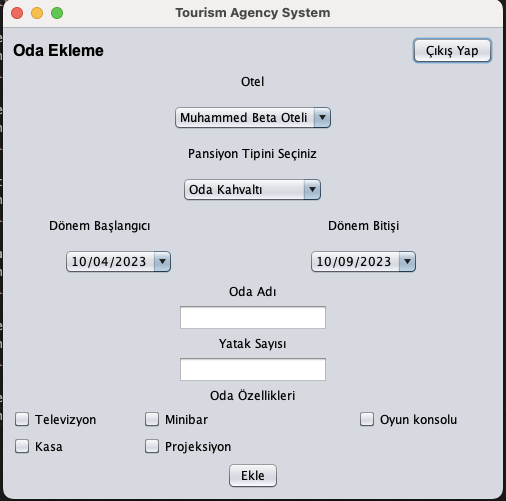

This repo is the Tourism Agency System.Project definition and project features are written below in detail.
Technologies used in the project : Java Swing GUI and JDBC MySQL.
In this project, 2 types of users are defined.
Admin:It has authority to add a user.
AgencyPerson: It has can add hotel and hotel room and hotel price and can make booking.

Login Screen
Operator can login from this screen.

Sign In Screen
AgencyPerson can register from this screen.

Hotel List Screen
AgencyPerson sees the hotel list from this screen.

Hotel Add Screen
AgencyPerson registers the hotel from this screen.

Hostel Type Screen
AgencyPerson sees and registers the hostel type list from this screen.

 Season Screen
AgencyPerson sees and registers the season from this screen.

Hotel Room Screen
AgencyPerson sees the room list from this screen.

Hotel Add Room Screen
AgencyPerson registers the hotel room from this screen.

Hotel Room Price Screen
AgencyPerson sees the room list from this screen.

Add Hotel Room Price Screen
AgencyPerson register the room price from this screen.

Search Hotel Screen
AgencyPerson list hotels

Booking Screen
AgencyPerson booking this screen

Booking List Screen
AgencyPerson list booking this screen.

The working logic of Patika Tourism Agency is as follows: Hotels make certain room reservations to Patika Tourism Agency and wait for the agency of these centers to sell them. When the agency sells these rooms, it distributes its own service fee as a percentage or a fixed price.

There is a change in these tasks when doing them on paper and manually is a waste of time, and a software is needed to make things easier.

The agency must manage the contracted hotels with their location information and other features from the system. When adding a hotel, other definitions such as Hotel Name, Address, E-mail, Telephone, Star, Facility Features, and Pension types are made.

Historical periods of the hotels are added and pricing is made based on these periods. The purpose here is to offer variable pricing. While hotel prices are higher in the summer months, this is less in the winter months. Pricing is made periodically in the tourism sector.

The agency adds the rooms it reserves from hotels to the system and provides pricing based on these rooms. In hotels, there are usually Single, Double, Suite etc. There are certain room types such as and stock logic is used to avoid adding the same type of room types repeatedly in the system.

Rooms are calculated on a per night basis. Prices are defined according to hostel and adult child types, based on the periods added for the hotel.

The agency employee should be able to search for rooms according to the date range, region or hotels and guest information entered through the system.
